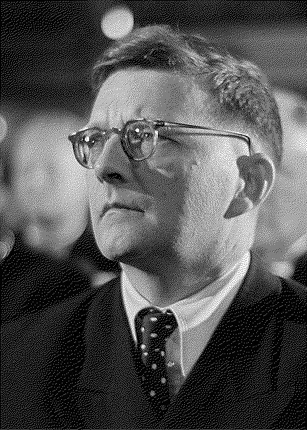

# 1Bit



Makes 1-bit images using ImageMagick and Floyd-Steinberg dithering.

Make sure ImageMagick is installed the compile with:

```
gcc 1bit.c -o 1bit `pkg-config --cflags --libs MagickWand`
```

Usage:

```
1bit [input image name] [output image name]
```
